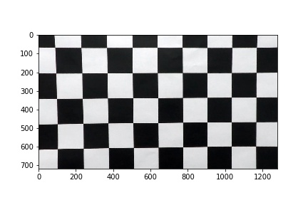
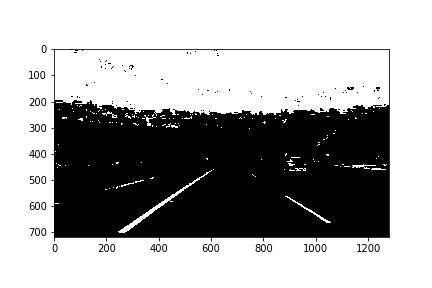
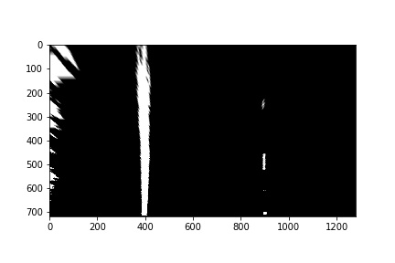
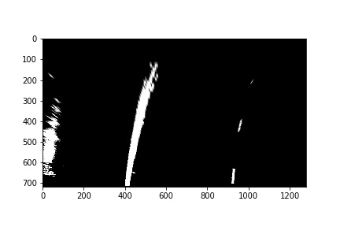
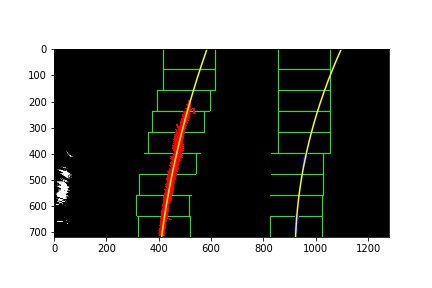
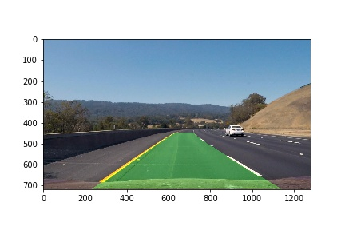

## Writeup Template

### You can use this file as a template for your writeup if you want to submit it as a markdown file, but feel free to use some other method and submit a pdf if you prefer.

---

**Advanced Lane Finding Project**

The goals / steps of this project are the following:

* Compute the camera calibration matrix and distortion coefficients given a set of chessboard images.
* Apply a distortion correction to raw images.
* Use color transforms, gradients, etc., to create a thresholded binary image.
* Apply a perspective transform to rectify binary image ("birds-eye view").
* Detect lane pixels and fit to find the lane boundary.
* Determine the curvature of the lane and vehicle position with respect to center.
* Warp the detected lane boundaries back onto the original image.
* Output visual display of the lane boundaries and numerical estimation of lane curvature and vehicle position.

[//]: # (Image References)


## [Rubric](https://review.udacity.com/#!/rubrics/571/view) Points

---

### Writeup / README

### Camera Calibration

#### 1. Briefly state how you computed the camera matrix and distortion coefficients. Provide an example of a distortion corrected calibration image.

The code for this step is contained in the second and third code cell of the IPython notebook located in "find_lane.ipynb". 
I start by preparing "object points", which will be the (x, y, z) coordinates of the chessboard corners in the world. Here I am assuming the chessboard is fixed on the (x, y) plane at z=0, such that the object points are the same for each calibration image.  Thus, `objp` is just a replicated array of coordinates, and `objpoints` will be appended with a copy of it every time I successfully detect all chessboard corners in a test image.  `imgpoints` will be appended with the (x, y) pixel position of each of the corners in the image plane with each successful chessboard detection.  

I then used the output `objpoints` and `imgpoints` to compute the camera calibration and distortion coefficients using the `cv2.calibrateCamera()` function.  I applied this distortion correction to the test image using the `cv2.undistort()` function and obtained this result: 


### Pipeline (single images)

#### 1. Provide an example of a distortion-corrected image.

I am using the Open CV `calibrateCamera()` to obtain the parameters neccessary do undistord the image. The distorted and the corrected imgage are shown here.

Original image:


<br/><br/><br/>

Undistorted image:




#### 2. Describe how (and identify where in your code) you used color transforms, gradients or other methods to create a thresholded binary image.  Provide an example of a binary image result.

I only used color thresholds to generate a binary image.  Here's an example of my output for this step.<br/>
See cell four, function `hls_select()`.



#### 3. Describe how (and identify where in your code) you performed a perspective transform and provide an example of a transformed image.

The code for my perspective transform is in cell three, the function is called 'corners_unwarp(undistorted_img, mtx, dist)', lines 1-16.
The `corners_unwarp()` function takes as inputs an undistorted image `undistorted_img`, as well as source (`src`) and destination (`dst`) points.
 I chose the hardcode the source and destination points in the following manner:

```python
src  =  np.float32([
	[525, undistorted_img.shape[0]//2 + 90],
	[undistorted_img.shape[1] - 525, undistorted_img.shape[0]//2 + 90],
	[undistorted_img.shape[1], undistorted_img.shape[0]],
	[0, undistorted_img.shape[0]]])
dst  =  np.float32([
	[0, 0],
	[undistorted_img.shape[1], 0],                                 
	[undistorted_img.shape[1]-280, undistorted_img.shape[0]], 
	[280, undistorted_img.shape[0]]])
 
```

This resulted in the following source and destination points:

| Source        | Destination   | 
|:-------------:|:-------------:| 
| 525, 450      | 0, 0        	| 
| 755, 450      | 1280, 0      	|
| 1280, 720     | 1000, 720     |
| 0, 720        | 280, 720      |

I verified that my perspective transform was working as expected by drawing the `src` and `dst` points onto a test image and its warped counterpart to verify that the lines appear parallel in the warped image.




#### 4. Describe how (and identify where in your code) you identified lane-line pixels and fit their positions with a polynomial?
In cell three, function `fit_polynomial()` first calculates a histogram to find the initial starting points lanes, after that applies the sliding window approach to find the points of the lines, and finally fits the lines through the found points.



#### 5. Describe how (and identify where in your code) you calculated the radius of curvature of the lane and the position of the vehicle with respect to center.

The code to calculate the curvature is also in cell three. The function is the last function in cell three and called `measure_curvature_real()`.

#### 6. Provide an example image of your result plotted back down onto the road such that the lane area is identified clearly.
The function that maps the lines back onto the road is called `draw_lines()` and is also in cell three.



---

### Pipeline (video)

#### 1. Provide a link to your final video output.  Your pipeline should perform reasonably well on the entire project video (wobbly lines are ok but no catastrophic failures that would cause the car to drive off the road!).

Here's a [link to my video result](./test_videos_output/project_video.mp4)

---

### Discussion

#### 1. Briefly discuss any problems / issues you faced in your implementation of this project.  Where will your pipeline likely fail?  What could you do to make it more robust?

Thanks for reviewing my work!

Transforming the perspective seems like a good step forward to me, because the weight of pixels that are further away is increased.
Still the whole pipeline seems very brittle to me. Lane detection on roads with perfect markers and pavement under good lighting conditions seems to work quite reliable.
As soon one of these parameters changes lane detection can brake easily. Finding the right parameters, e.g. thresholds or assuming certain parameters like line distance, for a certain video is still an important part for the project to succeed.

I had a quick look at the challange video, to me it seemed that it would require a lot a of tayloring to make lane detection work in this video,
but again would not work in other videos, like setting a perfect area of interested to get rid of the wall on the left.

To me it feels like a new approach is needed, so I am looking forward to work with neural networks.